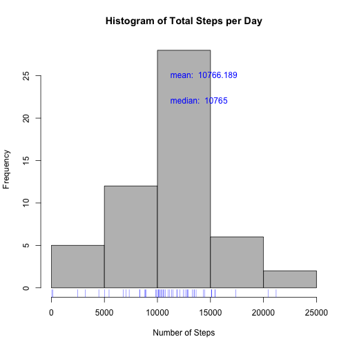
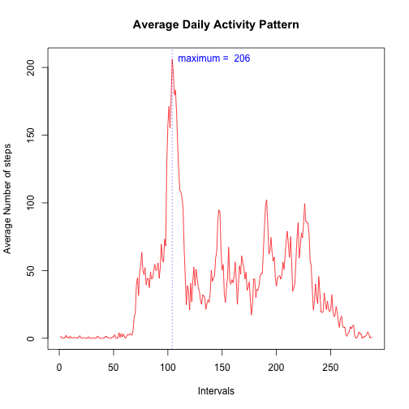
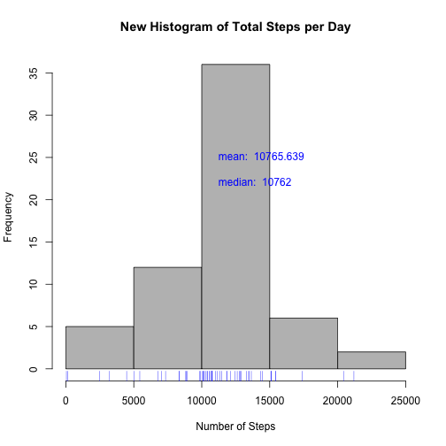
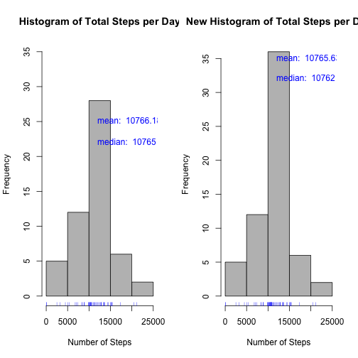
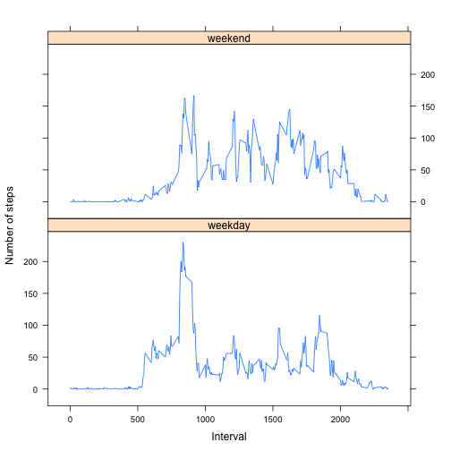

# Reproducible Research: Peer Assessment 1


## Loading and preprocessing the data
Download the zipped data file from the web and store it in the current directory. 
Once the zipped file is in the local directory, we load it using the unz command. 

We also convert the date column to a valid date format, pre-processing also involves 
removing NA values


```r
if(!file.exists("activity.zip")){
        fileUrl <- "https://d396qusza40orc.cloudfront.net/repdata%2Fdata%2Factivity.zip"
        download.file(fileUrl, destfile="activity.zip", meth="curl")
        dateDownloadtrain <- data()
}

data <- read.table(unz("activity.zip", "activity.csv"), 
                   header=T, quote="\"", sep=",")

data <- transform(data, date = as.Date(as.character(date, "%Y%m%d")))

#also remove NA values
Data <- subset(data,complete.cases(data)==TRUE)    
```

## What is mean total number of steps taken per day?

```r
# split the data by date and   
# count the number of steps taken for each day
StepsPerday<-sapply(split(Data,Data$date, drop=TRUE) 
                   , function(x) sum(x$steps)) 
# plot the histogram
hist(StepsPerday, main="Histogram of Total Steps per Day", xlab="Number of Steps", col="gray") 
# Add the median and the mean on the plot! 
text(mean(StepsPerday),25,labels= paste("mean: ", round(mean(StepsPerday), 3)), , pos=4, col="blue")
text(median(StepsPerday),22,labels= paste("median: ", median(StepsPerday)), , pos=4, col="blue")
rug(StepsPerday, col="blue")
```

 

Following are the <b>mean</b> and the <b>median</b> of the total number of steps per day. 


```r
summary(StepsPerday)
```

```
##    Min. 1st Qu.  Median    Mean 3rd Qu.    Max. 
##      41    8840   10800   10800   13300   21200
```

## What is the average daily activity pattern?

Time series plot of the 5-minute interval (x-axis) and the average number of steps taken, averaged across all days (y-axis).


```r
# split the data by interval and count in dailySteps 
# count the number of steps for each day
StepsPerIntervals<-sapply(split(Data,Data$interval, drop=TRUE) 
                   , function(x) mean(x$steps)) 

plot(StepsPerIntervals, type="l", main = "Average Daily Activity Pattern",
     ylab = "Average Number of steps", xlab = "Intervals", col = "red")
        abline(v=which.max(StepsPerIntervals), lty=3, col="blue") 
        text(which.max(StepsPerIntervals),max(StepsPerIntervals),  
     labels=paste("maximum = ",as.character(round(max(StepsPerIntervals)))), 
     pos=4, col="blue")
```

 

Which 5-minute interval, on average across all the days in the dataset, contains the maximum number of steps? 

As shown in the code bellow, it is the interval whose name is <b>835</b>, it has <b>206</b> steps on average, and the corresponding interval is the interval number <b>104 th</b>. 


```r
names(which.max(StepsPerIntervals))  
```

```
## [1] "835"
```

```r
round(max(StepsPerIntervals))
```

```
## [1] 206
```

```r
which.max(StepsPerIntervals)
```

```
## 835 
## 104
```

## Imputing missing values

Total number of missing values in the dataset (i.e. the total number of rows with NAs): <b>2304</b>


```r
allData <- complete.cases(data)
number.missingVals <- length(allData[allData == FALSE])

number.missingVals
```

```
## [1] 2304
```

To impute missing values, let us use the mean across all days for the 5-minute interval which the NA occurs.


```r
# A new data set with an extra column, indicating whether a given 
# record is complete
rawData <- complete.cases(data)
data.combined <- cbind(data, rawData)

# split by rawData
splitNewData <- split(data.combined, data.combined$rawData, drop=TRUE)

# Now for each row in the split data wher rawDatais FALSE
# replace NA with the interval average 
# We use the step per interval that we already calculated 

for (row in 1:nrow(splitNewData[["FALSE"]])){  
    splitNewData[["FALSE"]][row,1] <- round(subset(StepsPerIntervals,names(StepsPerIntervals) ==
                                     as.character(splitNewData[["FALSE"]][row,3])))
}

# splitNewData is a list that contains two data frames named respectively, TRUE 
# and FALSE. The FALSE data frame contains imputed average number of steps for the missing 5 
# interval.
# The TRUE data frame contains the raw data without missing values

# Put the data back in chronologcal order
newData <- rbind(splitNewData[["FALSE"]],splitNewData[["TRUE"]])
newData <- newData[with(newData, order(date, interval)), ]   
# Imputation done
head(newData)
```

```
##   steps       date interval rawData
## 1     2 2012-10-01        0   FALSE
## 2     0 2012-10-01        5   FALSE
## 3     0 2012-10-01       10   FALSE
## 4     0 2012-10-01       15   FALSE
## 5     0 2012-10-01       20   FALSE
## 6     2 2012-10-01       25   FALSE
```


Plot the histogram of the total number of steps taken each day and Calculate and report the mean and median total number of steps taken per day. Do these values differ from the estimates from the first part of the assignment? 


```r
# split the data by date and count in dailySteps 
# count the number of steps for each day
StepsPerday<-sapply(split(newData,newData$date, drop=TRUE) 
                   , function(x) sum(x$steps)) 
# plot the histogram
hist(StepsPerday, main="New Histogram of Total Steps per Day", xlab="Number of Steps", col="gray") 
# Add the median and the mean on the plot! 
text(mean(StepsPerday),25,labels= paste("mean: ", round(mean(StepsPerday), 3)), , pos=4, col="blue")
text(median(StepsPerday),22,labels= paste("median: ", median(StepsPerday)), , pos=4, col="blue")
rug(StepsPerday, col="blue")
```

 

The mean and the median remain the same while quartiles vary slightly.


```r
summary(StepsPerday)
```

```
##    Min. 1st Qu.  Median    Mean 3rd Qu.    Max. 
##      41    9820   10800   10800   12800   21200
```

Impact of imputing missing data on the estimates of the total daily number of steps!
The main difference is in the number of observations for the center bar in the histogram (recall that the median and the mean where nearly the same).


```r
par(mfrow=c(1,2))


StepsPerday<-sapply(split(Data,Data$date, drop=TRUE) 
                   , function(x) sum(x$steps)) 
# plot the histogram
hist(StepsPerday, main="Histogram of Total Steps per Day", xlab="Number of Steps", col="gray", ylim=c(0,35)) 
# Add the median and the mean on the plot! 
text(mean(StepsPerday),25,labels= paste("mean: ", round(mean(StepsPerday), 3)), , pos=4, col="blue")
text(median(StepsPerday),22,labels= paste("median: ", median(StepsPerday)), , pos=4, col="blue")
rug(StepsPerday, col="blue")


StepsPerday<-sapply(split(newData,newData$date, drop=TRUE) 
                   , function(x) sum(x$steps)) 
# plot the histogram
hist(StepsPerday, main="New Histogram of Total Steps per Day", xlab="Number of Steps", col="gray") 
# Add the median and the mean on the plot! 
text(mean(StepsPerday),35,labels= paste("mean: ", round(mean(StepsPerday), 3)), , pos=4, col="blue")
text(median(StepsPerday),32,labels= paste("median: ", median(StepsPerday)), , pos=4, col="blue")
rug(StepsPerday, col="blue")
```

 


## Are there differences in activity patterns between weekdays and weekends?


Let us create a new factor variable in the dataset with two levels – “weekday” and “weekend” indicating whether a given date is a weekday or weekend day.


```r
        require(lattice) # Since we will latter use the qplot function from the lattice package letter 
```


```r
newData$date <- as.Date(strptime(newData$date, format="%Y-%m-%d"))
# 'day' factor that holds  weekday / weekend  
newData$day <- weekdays(newData$date)                              
for (i in 1:nrow(newData)) {                                        
    if (newData[i,]$day %in% c("Saturday","Sunday")) {             
        newData[i,]$day<-"weekend"                                
    }
    else{
        newData[i,]$day<-"weekday"       #weekday                         
    }
}


## aggregate newData by steps as a function of interval + day  
stepsByDay <- aggregate(newData$steps ~ newData$interval + newData$day, newData, mean)

## reset the column names to be pretty & clean
names(stepsByDay) <- c("interval", "day", "steps")

par(mfrow=c(1,1))


StepsPerIntervals<-sapply(split(newData,newData$interval, drop=TRUE) 
                   , function(x) mean(x$steps)) 

xyplot(steps ~ interval | day,  layout = c(1, 2), data=stepsByDay, 
       prepanel = function(x, y) prepanel.loess(x, y, span = 1),
       ylab = "Number of steps", xlab = "Interval", type="l",
       panel= function(x,y, ...){
        panel.xyplot(x, y, ...)
})
```

 


